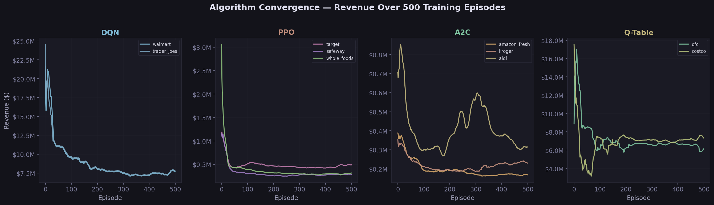
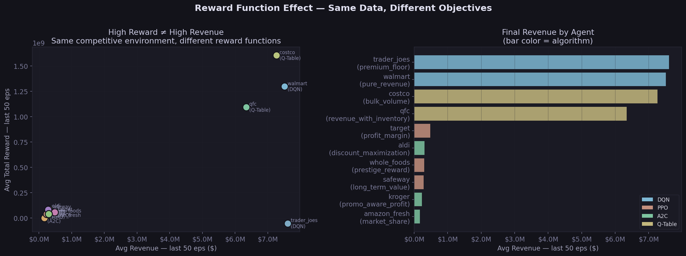
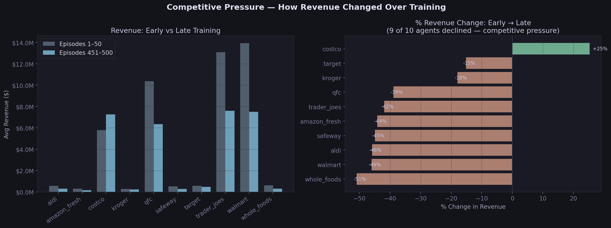
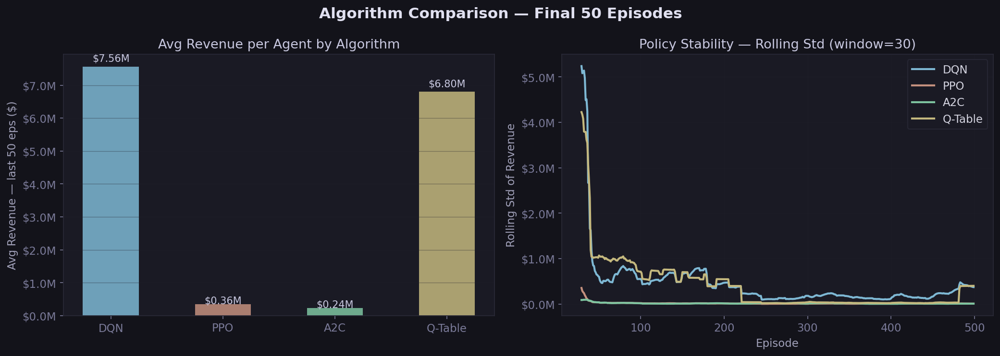

# RetailRL 🛒

> Multi-agent reinforcement learning simulation of competitive retail pricing dynamics

**10 grocery retailers. 4 RL algorithms. 500 training episodes. One shared market.**

Each agent represents a real US retailer — Walmart, Target, Amazon Fresh, and 7 others — competing through dynamic pricing across 50 products, inventory constraints, supply chain delays, and promotional cycles. Every agent optimizes a different objective: pure revenue, profit margin, market share, or brand prestige. The result is emergent competitive behavior where learned strategies diverge based on incentive design, not just algorithm choice.

[](https://reinforcement-learning-retail-project-mehul-goel.streamlit.app/)
[](https://www.python.org/)
[](https://pytorch.org/)
[](LICENSE)

---

## 🔴 Live Dashboard

**[→ reinforcement-learning-retail-project-mehul-goel.streamlit.app](https://reinforcement-learning-retail-project-mehul-goel.streamlit.app/)**

Interactive 5-tab dashboard showing:
- Revenue and market share curves across 500 training episodes
- Algorithm convergence comparison (DQN vs PPO vs A2C vs Q-Table)
- Strategy divergence scatter plots — reward vs revenue per agent
- Per-episode replay with bar charts and training context
- Agent deep-dive with reward distributions and field comparisons

---

## Key Results

**Strategy divergence is the central finding.** Agents optimizing non-revenue rewards developed fundamentally different pricing strategies — and they work.

| Agent | Algorithm | Reward Function | Outcome |
|---|---|---|---|
| Walmart | DQN | Pure Revenue | Consistent revenue leader at ~$7.5M/ep; eroded 46% from early dominance as competitors adapted |
| Costco | Q-Table | Bulk Volume | Highest total reward despite mid-tier revenue; discovered a resilient volume niche |
| Whole Foods | PPO | Prestige Reward | Reward of 41M but revenue of only $300k; intentionally prices high to maintain brand positioning |
| Amazon Fresh | A2C | Market Share | Lowest revenue by design; loss-leader strategy optimizes customer capture over margin |
| QFC | Q-Table | Revenue + Inventory | Stable $6.3M/ep; tabular methods found a consistent niche despite simpler representation |

**Competitive pressure is measurable.** 9 out of 10 agents saw revenue decline from early to late training — meaning agents learned to undercut and respond to dominant strategies. Costco was the only agent to grow (+25%), having found a pricing niche others couldn't easily exploit.

**Algorithm convergence differs significantly.** PPO and A2C stabilize earliest (rolling std near zero by episode 100). DQN shows higher early variance due to epsilon-greedy exploration. Q-Table remains noisier throughout but finds competitive long-run performance for revenue-focused objectives.

---

## Baselines

Before training any RL agents, the environment was validated using three rule-based agents run in isolation across 50 episodes (see `notebooks/02_env_validation.ipynb`).

| Agent | Strategy | Avg Revenue | Avg Market Share |
|---|---|---|---|
| RandomAgent | Random price multiplier each day | ~$1.2M | ~10% |
| FixedMarginAgent | Always hold price at base | ~$3.1M | ~10% |
| AlwaysCheapestAgent | Always undercut competitor average | ~$4.8M | ~10% |

With rule-based agents, market share splits evenly at ~10% per store — no agent learns to differentiate. RL agents break this symmetry: revenue-focused agents reach **$7.5M+** while non-revenue agents develop genuinely different strategies. The best rule-based agent (AlwaysCheapest at $4.8M) is beaten by the top RL agents by **57%**.

---

## Analysis & Ablations

All plots generated from 500-episode training data via `python -m retailrl.make_ablation_plots`.

### Algorithm Convergence



DQN agents start high ($20M+) and converge down as competition intensifies. PPO and A2C agents with non-revenue objectives stabilize quickly — they're succeeding on their own terms. Q-Table agents are noisiest but find competitive performance for revenue objectives.

### Reward Function Drives Strategy



Same competitive environment, same algorithms — reward function design determines behavior. Costco (Q-Table + bulk_volume) achieves high reward at high revenue. Whole Foods (PPO + prestige_reward) achieves high reward at near-zero revenue, intentionally pricing above market average. These strategies emerged from the reward signal alone.

### Competitive Pressure



9 of 10 agents declined in revenue from early to late training — direct evidence of competitive learning. Whole Foods dropped 51% (can't cut prices due to prestige reward). Walmart dropped 46% (competitors learned to undercut it). Costco is the only agent to grow (+25%), having found a bulk-volume niche that was hard to compete with on price alone.

### Algorithm Final Performance



DQN leads revenue at $7.56M because its agents have revenue-focused reward functions. Q-Table follows at $6.80M. PPO and A2C appear lower because those agents optimize prestige, LTV, and promo-profit — not revenue. The stability chart shows DQN and Q-Table variance dropping sharply after episode 50 as policies converge.

---

## Architecture

### Environment

A custom multi-agent environment built from scratch (not a wrapper around existing RL environments):

- **50 products** across grocery categories with realistic base prices and demand elasticities
- **2,000 customers per day**, each choosing a store via a Multinomial Logit (MNL) demand model sensitive to price, promotions, and stockouts
- **365-day episodes** with holiday demand spikes (Thanksgiving/Christmas produce 2–3× normal demand)
- **Inventory system** with reorder points, lead times, and stockout penalties
- **Promotional cycles** — random discount events that shift customer price sensitivity
- **Observation space**: 716-dimensional per agent (own prices, competitor prices, inventory state, momentum, agent identity, day)
- **Action space**: Discrete price multipliers per product (0.8× to 1.3× base price)

### Opponent Modeling

Each neural agent includes an `OpponentEncoder` module that processes the 9×50 competitor price block into a 64-dimensional embedding via a permutation-invariant mean aggregation. This embedding is concatenated with the agent's own state before the policy/value heads, enabling agents to condition their pricing strategy on what competitors are doing.

```
Competitor prices (450-dim) → OpponentEncoder → 64-dim embedding
                                                        ↓
Own state (266-dim) → Backbone MLP → 256-dim → [cat] → Policy / Value heads
```

### Agents

| Agent | Algorithm | Reward Function | Notes |
|---|---|---|---|
| Walmart | DQN | `pure_revenue` | Volume player; aggressive on staples |
| Target | DQN | `profit_margin` | Won't race to the bottom; brand differentiation |
| Amazon Fresh | DQN | `market_share` | Subsidizes losses to crowd out competitors |
| QFC | Q-Table | `revenue_with_inventory` | Balances pricing with stockout risk |
| Safeway | PPO | `long_term_value` | Trades short-term margin for customer retention |
| Kroger | PPO | `promo_aware_profit` | Times promos for peak efficiency |
| Trader Joe's | A2C | `premium_floor` | Penalized for pricing below a floor |
| Whole Foods | A2C | `prestige_reward` | Prestige score drops if price too low vs market |
| Aldi | Q-Table | `discount_maximization` | Always-cheap benchmark |
| Costco | Q-Table | `bulk_volume` | Volume-based loyalty; ignores per-unit margin |

### Neural Architecture

**DQN** — Experience replay buffer (10k transitions), epsilon-greedy exploration (ε: 1.0→0.05), target network with soft updates. OpponentEncoder + 256-dim backbone → Q-values over discrete price actions.

**PPO** — Clipped surrogate objective, GAE advantage estimation (λ=0.95), 128-step rollouts. Shared actor-critic backbone with OpponentEncoder.

**A2C** — Synchronous advantage actor-critic, 5-step n-step returns. Smaller 128-dim backbone (more frequent updates). OpponentEncoder integrated into shared trunk.

**Q-Table** — Tabular with discretized state (own price bin, avg competitor price bin, stock level, day bucket). No neural network, no opponent modeling. Serves as interpretable baseline.

---

## Project Structure

```
Reinforcement-Learning-Retail-Project/
├── environment/
│   └── retail_env.py          # Custom multi-agent env (716-dim obs, MNL demand)
├── agents/
│   ├── opponent_encoder.py    # Shared OpponentEncoder module
│   ├── dqn/dqn_agent.py       # DQN with experience replay + opponent modeling
│   ├── ppo/ppo_agent.py       # PPO actor-critic + opponent modeling
│   ├── a2c/a2c_agent.py       # A2C + opponent modeling
│   └── qtable/qtable_agent.py # Tabular Q-learning baseline
├── utils/trainer.py           # Multi-agent training loop
├── retailrl/
│   ├── train.py               # CLI training script
│   ├── run_ablations.py       # Ablation study runner
│   └── make_ablation_plots.py # Plot generation from training data
├── config/
│   ├── agent_config.yaml      # Agent algorithm + reward function assignments
│   └── env_config.yaml        # Environment hyperparameters
├── notebooks/
│   ├── 01_eda_instacart.ipynb  # Environment + data exploration
│   ├── 02_env_validation.ipynb # Rule-based agent baselines
│   └── 03_training.ipynb       # 500-episode training run + analysis
├── results/
│   ├── training_results.csv    # Per-agent per-episode metrics
│   ├── agent_meta.json         # Algorithm and reward function metadata
│   ├── episode_summaries.json  # Per-episode revenue/share/reward summaries
│   └── ablations/              # Ablation study plots
├── tests/                      # pytest suite (8 test files)
├── dashboard.py                # Streamlit interactive dashboard
├── requirements.txt
└── pyproject.toml
```

---

## Setup

```bash
# Clone
git clone https://github.com/goel-mehul/Reinforcement-Learning-Retail-Project.git
cd Reinforcement-Learning-Retail-Project

# Create environment
conda create -n retailrl python=3.11 -y
conda activate retailrl

# Install
pip install -e ".[dev]"
pip install gymnasium torch
```

### Run the dashboard locally

```bash
pip install streamlit plotly
streamlit run dashboard.py
```

### Run training

**Via CLI (recommended):**
```bash
python -m retailrl.train --episodes 500 --seed 42
```

**Via notebook:**
Open `notebooks/03_training.ipynb` and run all cells. Training 500 episodes with 2,000 customers takes approximately 60–70 minutes on a MacBook Air M2.

### Reproduce ablation plots

```bash
python -m retailrl.make_ablation_plots --data results/training_results.csv --out results/ablations
```

---

## Reproducing Results

The trained results are already committed to `results/` so the dashboard works out of the box. To retrain from scratch:

```bash
# Full 500-episode run
python -m retailrl.train --episodes 500 --seed 42 --out results/

# Quick 5-episode smoke test
python -m retailrl.train --episodes 5 --seed 42
```

Results are saved automatically in the exact format the dashboard expects: `training_results.csv`, `agent_meta.json`, and `episode_summaries.json`.

---

## Stack

| Category | Libraries |
|---|---|
| RL & Training | PyTorch, custom DQN/PPO/A2C/Q-Table implementations |
| Environment | gymnasium, numpy, scipy (MNL demand model) |
| Data | pandas, PyYAML |
| Visualization | Streamlit, Plotly, matplotlib |
| Dev | pytest, black, ruff, pyproject.toml |

---

## What I Learned

This project was built as part of an NYU Reinforcement Learning course with the goal of going beyond standard single-agent CartPole/Atari benchmarks into a realistic multi-agent problem with economic grounding.

The most interesting finding wasn't algorithmic — it was about **reward function design**. The agents that look "bad" on a revenue leaderboard (Whole Foods, Amazon Fresh, Safeway) are actually succeeding on their own terms. Whole Foods with a prestige reward learned to price at a premium without any explicit instruction to do so. Amazon Fresh with a market share reward learned to undercut everyone, accepting near-zero revenue. These behaviors emerged purely from the reward signal interacting with a competitive environment — which is exactly what you'd want from a well-designed RL system.

The opponent modeling module (OpponentEncoder) gave DQN and PPO agents a dedicated representational pathway for competitor behavior — rather than mixing 450 competitor price dimensions into the backbone MLP, the encoder produces a focused 64-dim embedding of "what competitors are doing right now."

---

## Author

**Mehul Goel** — NYU, Reinforcement Learning · 2026

[](https://github.com/goel-mehul)
